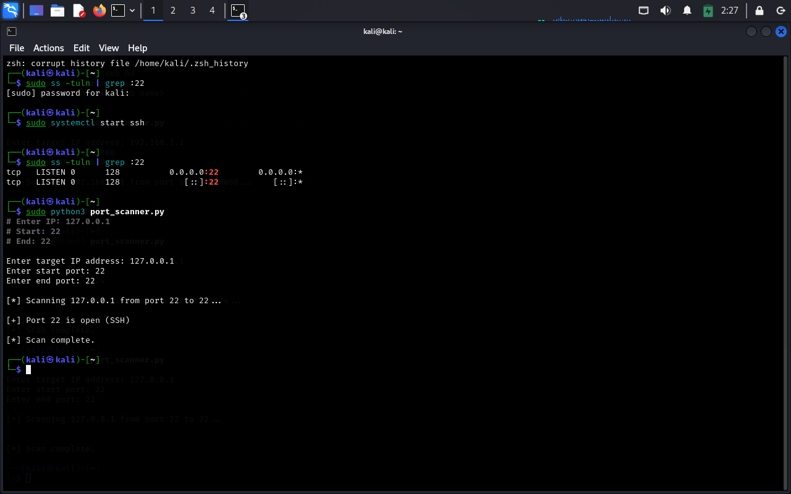

# Port-Scanner-Using-Python

A simple command-line port scanner tool built with Python that detects open ports on a given IP address or website. This tool helps in the basic vulnerability assessment of a network.

---

## 📌 Problem Statement

Network ports are entry points for services. Open or vulnerable ports can be exploited by attackers. Identifying open ports is essential for securing systems.

---

## 🎯 Objective

Build a Python-based port scanner to:
- Identify open ports on a specific IP address or domain
- Perform fast scanning using multithreading
- Output open ports directly in the terminal

---

## 🧰 Technologies Used

- **Python 3**
- `socket` module
- `threading` module
- Command-Line Interface (CLI)

---

## ⚙️ Features

- Scan up to any custom port range (e.g., 1–1000)
- Multithreaded for faster scanning
- Simple and clean CLI output
- Detects open TCP ports

---

## 🛠️ Requirements

- Python 3.x
- Works on Linux, Windows, macOS
- No external libraries needed

---

## 🚀 How to Run

1. Clone the repository or download the file.

2. Run the following command in terminal:

```bash
python port_scanner.py <target_ip> <max_port>
```
### 💻 GUI in Action
 |  |


 ✅ Built by **Kalpesh Dhamanse** —  [GitHub](https://github.com/Kalpeshdhamanse/Port-Scanner-Using-Python.git)

